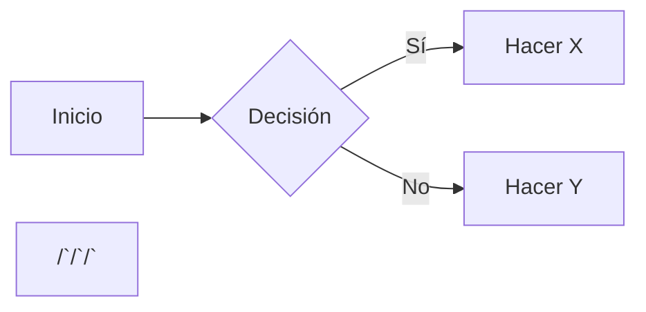

## Unidad 1: Second Brain

Vivimos en un mundo donde la información nos abraza (o nos ahoga, dependiendo de cómo lo mires). Entre correos electrónicos, mensajes de texto, artículos, libros, podcasts, webinars y esas notas de reuniones que parecen más un laberinto que un resumen, la tarea de recordar todo se convierte en una misión digna de un superhéroe. Pero, ¿y si te dijera que hay una forma más inteligente de manejar todo este caos? Aquí es donde entra en juego tu Segundo Cerebro

Imagina tener un sistema digital donde puedes almacenar y organizar todo ese conocimiento disperso. Un Segundo Cerebro es precisamente eso: un espacio centralizado para tus ideas, aprendizajes y conexiones. Es como tener un asistente personal que nunca se olvida de nada y que, además, no necesita café para funcionar.

### Beneficios de un Second Brain

A diario, generamos una cantidad abrumadora de información. Tomamos notas en reuniones, sacamos fotos de pizarra, grabamos ideas "brillantes" en un momento de inspiración y leemos libros que prometen cambiar nuestra vida. Sin embargo, todo ese conocimiento se queda disperso en diferentes aplicaciones, carpetas y, seamos honestos, en algún rincón oscuro de nuestra mente.

La buena noticia es que con un poco de intención y un sistema adecuado, podemos convertir ese desorden en un recurso valioso. Al hacerlo, no solo preservamos el conocimiento, sino que también aumentamos su valor con el tiempo.

Al descargar parte de nuestro pensamiento en un Second Brain, liberamos espacio mental para lo que realmente importa: **crear, imaginar y estar presentes**. Como dijo David Allen: “Tu mente está para tener ideas, no para retenerlas.” Podemos vivir con la tranquilidad de que no se nos va a escapar lo esencial, sin el estrés de tener que recordarlo todo.

En lugar de buscar en mil lugares diferentes, un Segundo Cerebro te permite tener todo a mano. Imagina abrir una sola aplicación y encontrar tus notas, tus ideas y tus proyectos en un instante.

.png)

### Metodología CODE

Para construir un Second Brain se utiliza el método CODE, que consiste en cuatro simples pasos.

**Paso 1. Capturar (Capture)**. Guardar en un solo lugar (por ejemplo Notion) todo lo relevante que encuentres: notas, citas, enlaces, ideas. No acumulamos todo, sino lo que resuena contigo. Filtra contenido valioso, sal del ciclo reactivo (guarda para más tarde en vez de consumir de inmediato), y conserva lo que realmente te importa.

**Paso 2. Organizar (Organize)**. Ordena lo capturado usando el método P.A.R.A.:

- **P** de proyectos: cosas en curso (p.ej. “Apuntes de Algoritmos”).
- **A** de áreas: responsabilidades continuas (p.ej. “Salud”, “Trabajo”).
- **R** de recursos: temas de interés o referencia (p.ej. "marketing", "recetas").
- **A** de archivo: material finalizado o histórico.

**Paso 3. Destilar (Distill)**. Simplifica la información guardada. Resalta y reescribe con tus propias palabras, quedándote solo con lo esencial. Evita copiar bloques largos; enfócate en ideas clave. Pregúntate si aquello te servirá al repasar dentro de meses.

**Paso 4. Expresar (Express)**. El fin de tu Second Brain es usarlo. Crea, resuelve problemas o toma decisiones apoyándote en el conocimiento recopilado. Recuerda que el valor del saber está en lo que puedes hacer con él.

Pero veamos más en detalle estos pasos.

### Capturar

El primer paso es **capturar** en un solo lugar digital (como [Notion](https://www.notion.so/), [Obsidian](https://obsidian.md/), [Evernote](https://evernote.com/), [Apple Notes](https://www.icloud.com/notes/), entre otros) las ideas, citas, artículos, notas y todo aquello que te llame la atención o que creas que puede servirte más adelante. Muchas veces ya lo hacemos: nos mandamos mensajes con ideas, escribimos en una libreta (yo aún uso papel y lápiz), marcamos artículos... pero todo queda disperso.

Principios para capturar bien:

- **Pensá como un curador**  
  
  No todo lo que ves es valioso. Filtrá la información que realmente te nutre en vez de dejarte llevar por lo que los algoritmos te empujan a consumir.

- **Salí del ciclo reactivo**  
  
  En lugar de leer todo ya mismo, guardalo para más tarde. Usá herramientas como [Readwise Reader](https://readwise.io/read), [Instapaper](https://www.instapaper.com/)  para elegir cuándo y qué consumir.

- **Guardá lo que resuena con vos**  
  
  No es necesario quedarte con todo. Si algo te llama la atención, si te inspira o conecta con vos, capturalo. No parece, pero la intuición a veces es una brújula.

### Herramientas recomendadas para capturar

| Herramienta            | Uso principal               | Comentario |
|------------------------|-----------------------------|-------------------------------------------|
| [Notion](https://www.notion.so/)             | Captura + organización      | Versátil, integrable, multiplataforma     |
| [Readwise Reader](https://readwise.io/read)    | Lectura diferida + subrayado| Ideal para artículos, newsletters y PDFs  |
| [Obsidian](https://obsidian.md/)           | Notas interconectadas       | Potente para pensar en red                |
| [Apple Notes](https://www.icloud.com/notes/)        | Captura rápida              | Simple, nativa en iOS/macOS               |
| [Instapaper](https://www.instapaper.com/)         | Guardar para leer después   | Buenas para curar contenido               |

 

### Ejemplos prácticos de captura

- Estás leyendo un artículo sobre realidad virtual → Lo guardás en _Reader_ y subrayás las ideas clave.
- Escuchás una frase inspiradora en un _podcast_ → La escribís rápido en _Notion_ con una etiqueta “Inspiración”.
- Se te ocurre una idea para un proyecto → La capturás en tu _app_ de notas, y luego la movés a la carpeta de _Proyectos_.

> “Capturar no es acumular. Es construir tu biblioteca de pensamientos.”  
> — _Versión adaptada del método CODE_

### Ordenar

Una vez que tenés tus notas en un solo lugar, el paso siguiente es **ordenar**. No se trata de categorizar todo de forma obsesiva, sino de tener una estructura clara que puedas navegar fácilmente. Recordá usar el método PARA.


Todo lo que guardás y organizás tiene un fin: **ponerlo en acción**. Este es el momento de crear, enseñar, automatizar, escribir, resolver problemas o tomar decisiones con la ayuda de tu Second Brain.

**Empezá con una hoja en blanco**

El mayor obstáculo para implementar el sistema PARA (o cualquier otro sistema de organización) es que muchas personas creen que deben clasificar todos sus archivos y notas actuales dentro de ese sistema.

Esta tarea podría llevar horas, o incluso días. Y el resultado probablemente sea que no tengamos ningún resultado porque no sentimos abrumados por la cantidad de información que tenemos que manejar.

En cambio, te recomiendo lo siguiente (y no te va a llevar más de 60 segundos):

1. Mové todos tus archivos actuales a una carpeta llamada _Archivo_ con la fecha de hoy.

2. Pensá en esta carpeta como una “cápsula del tiempo” que guarda todo lo que venías haciendo hasta este momento. Ahora tenés una línea divisoria clara entre lo viejo (antes de hoy) y lo nuevo (lo que vas a guardar desde ahora en adelante).

¡Y ya estamos! Tu espacio digital está limpio y listo para arrancar desde cero.

Lo mejor es que no estás borrando nada. Si necesitás un archivo viejo, siempre podés buscarlo en la carpeta de _Archivo_. Pero seguro que no vas a necesitar tantos documentos antiguos como pensás.

**Tres preguntas para organizar tu información**

Ahora que empezás con una hoja limpia, ¿cómo procesás los nuevos elementos dentro de las carpetas del sistema PARA?

Hacete estas tres preguntas para decidir en qué proyecto, área o recurso es más útil la información:

1. ¿En qué proyecto me serviría esto?

2. Si no aplica a un proyecto: ¿En qué área me sería útil?

3. Si no aplica a un área: ¿A qué recurso pertenece?

Si no encaja en ninguno, probablemente lo mejor sea archivarlo o no guardarlo y nos vimos en Disney.

Se recomienda hacer esta organización una vez por semana. No te compliques demasiado eligiendo dónde guardar algo dentro del sistema PARA. Recordá que casi siempre vas a poder encontrar lo que necesites con una simple búsqueda.

### Destilar

Este paso transforma tu información en conocimiento real. Se trata de **resumir, resaltar y reformular** lo que capturaste, para que sea fácil de entender y aplicar.

- Evitá copiar y pegar grandes bloques.
- Quedate con las ideas clave.
- Escribí con tus propias palabras, pensando en tu _yo del futuro_.

Preguntate: ¿esto me va a servir cuando lo vuelva a leer dentro de 3 meses?

### Expresar

Todo lo que guardás y organizás tiene un fin: **ponerlo en acción**.

Este es el momento de crear, enseñar, automatizar, escribir, resolver problemas o tomar decisiones con la ayuda de tu Second Brain.

> El conocimiento no sirve solo por estar guardado.  
> Sirve por lo que te permite hacer con él.

Un Segundo Cerebro es una fábrica, no un depósito. La información solo se convierte en conocimiento real –algo personal, incorporado y con sentido– cuando la usamos activamente. Por eso, es importante dejar de enfocarnos tanto en consumir contenido y empezar a dedicar más energía a crear.

Lo que creamos –ya sea un texto, una _web_, una foto, un video o una presentación en vivo– es la expresión concreta del conocimiento que adquirimos a través de nuestras experiencias.

Tu Segundo Cerebro no debería ser solo un lugar donde acumular ideas valiosas, como si fuera un depósito. Debería ser una fábrica, un espacio activo donde esas ideas se transforman en resultados tangibles.

Todas las personas necesitamos participar en la creación de algo bueno, verdadero o bello. Crear no solo es profundamente satisfactorio, sino que también puede abrir puertas inesperadas, conectar con otras personas y generar impacto: inspirando, entreteniendo o informando a quienes nos rodean.

Una vez que empezás a recopilar y dar forma externa a tu conocimiento más valioso, tu forma de trabajar cambia por completo. Ya no se trata de empezar desde cero cada vez, sino de reutilizar, combinar y mejorar lo que ya construiste. Así nace una nueva manera de producir: más ágil, más estratégica y más creativa.

### Notion

Notion es una plataforma colaborativa tipo todo-en-uno para notas y gestión de proyectos.

Esta plataforma está basada en bloques: párrafos de texto, encabezados, listas, imágenes, tablas, etc. Cada bloque es una pieza de contenido que se puede editar libremente.

Dentro de Notion existen también bases de datos, que son colecciones de páginas (cada página es un registro con propiedades). Por ejemplo, podes tener una base de datos de tareas o de aprendizaje. Las bases de datos en Notion permiten vistas diferentes: tabla, lista, calendario, tablero (Kanban), galería, entre otras. Cada vista filtra o muestra los mismos datos de forma distinta. Además, Notion ofrece plantillas predefinidas (de proyectos, gestores de tareas, diarios, etc.) para usar y modificar según tus necesidades. 

En Notion se puede escribir utilizando sintaxis Markdown. Por ejemplo:

/# Título principal
/#/# Subtítulo

- Lista con viñetas
- /*/*Texto en negrita/*/*, /*texto en cursiva/*, /`código/`.

1. Lista numerada
2. Segundo ítem

[Enlace](https://example.com)
> Cita en bloque

Estos elementos aparecerán como bloques de encabezado, lista, texto resaltado, código o link en Notion. Además de Markdown, puedes usar atajos de barra (/): por ejemplo, /page crea una nueva subpágina, /db crea una base de datos, /callout un recuadro destacado, /code un bloque de código, etc.

### Ejemplos de uso de Notion y Markdown

Supongamos que creas una página de notas para un proyecto de curso. Podrías escribir en Markdown:

```none
# Plan de curso de IA

## Objetivos
- Crear un asistente virtual personalizado.
- Aprender a conectar APIs en herramientas No-Code.

## Tareas
1. Investigar herramientas No-Code (Make, Zapier).
2. Escribir un prompt para ChatGPT.
3. Diseñar un diagrama en Mermaid (Notion permite diagramas Markdown).


