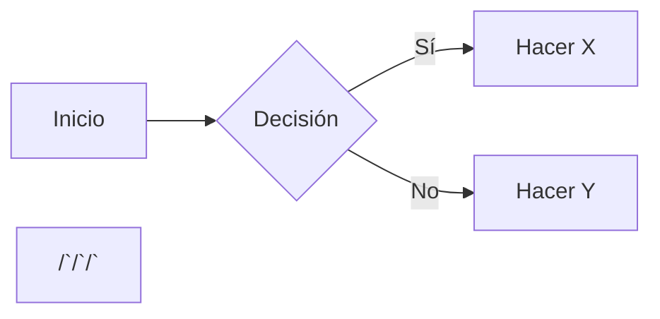

## Notion

Notion es una plataforma colaborativa tipo todo-en-uno para notas y gestión de proyectos.

Esta plataforma está basada en bloques: párrafos de texto, encabezados, listas, imágenes, tablas, etc. Cada bloque es una pieza de contenido que se puede editar libremente.

Dentro de Notion existen también bases de datos, que son colecciones de páginas (cada página es un registro con propiedades). Por ejemplo, podes tener una base de datos de tareas o de aprendizaje. Las bases de datos en Notion permiten vistas diferentes: tabla, lista, calendario, tablero (Kanban), galería, entre otras. Cada vista filtra o muestra los mismos datos de forma distinta. Además, Notion ofrece plantillas predefinidas (de proyectos, gestores de tareas, diarios, etc.) para usar y modificar según tus necesidades. 

En Notion se puede escribir utilizando sintaxis Markdown. Por ejemplo:

/# Título principal
/#/# Subtítulo

- Lista con viñetas
- /*/*Texto en negrita/*/*, /*texto en cursiva/*, /`código/`.

1. Lista numerada
2. Segundo ítem

[Enlace](https://example.com)
> Cita en bloque

Estos elementos aparecerán como bloques de encabezado, lista, texto resaltado, código o link en Notion. Además de Markdown, puedes usar atajos de barra (/): por ejemplo, /page crea una nueva subpágina, /db crea una base de datos, /callout un recuadro destacado, /code un bloque de código, etc.

## Ejemplos de uso de Notion y Markdown

Supongamos que creas una página de notas para un proyecto de curso. Podrías escribir en Markdown:

```none
# Plan de curso de IA

## Objetivos
- Crear un asistente virtual personalizado.
- Aprender a conectar APIs en herramientas No-Code.

## Tareas
1. Investigar herramientas No-Code (Make, Zapier).
2. Escribir un prompt para ChatGPT.
3. Diseñar un diagrama en Mermaid (Notion permite diagramas Markdown).



## Actividades prácticas

1. **Crear tu base de conocimiento en Notion:** Crea una nueva página llamada “Base de Conocimiento”. Dentro, añade bloques de texto, enlaces e imágenes con información que consideres relevante (artículos, notas de cursos, ideas). Organiza el contenido con encabezados y listas.  

2. **Implementar el sistema P.A.R.A. en Notion:** En tu espacio de trabajo, crea cuatro páginas principales llamadas “Proyectos”, “Áreas”, “Recursos” y “Archivo”. Por ejemplo, en “Proyectos” crea subpáginas para cada proyecto en curso. Asigna tus notas existentes a alguna de estas categorías.  

3. **Ejercicio de captura semanal:** Durante una semana, cada vez que encuentres algo interesante (una cita, artículo, idea), añádelo a Notion en la sección correspondiente (p. ej., “Recursos” o “Proyectos”). Al final de la semana, revisa lo capturado y etiqueta o mueve lo necesario para que siempre esté accesible.